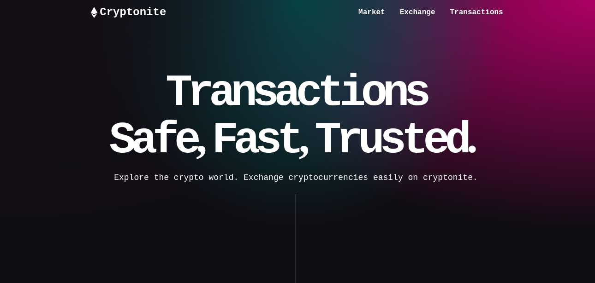

# CRYPTO-NET

[![Contributors][contributors-shield]][contributors-url]
[![Forks][forks-shield]][forks-url]
[![Stargazers][stars-shield]][stars-url]
[![Issues][issues-shield]][issues-url]
[![MIT License][license-shield]][license-url]
[![LinkedIn][linkedin-shield]][linkedin-url]

<!-- logo-->
 

  <a href="https://github.com/othneildrew/Best-README-Template">
  <svg stroke="currentColor" fill="currentColor" stroke-width="0" viewBox="0 0 320 512" class="text-white" height="4em" width="4em" xmlns="http://www.w3.org/2000/svg"><path d="M311.9 260.8L160 353.6 8 260.8 160 0l151.9 260.8zM160 383.4L8 290.6 160 512l152-221.4-152 92.8z"></path></svg>
    <h1>CryptoNet</h1>
  </a>

  <h3 align="center">Crypto-Net And AI Forcasting</h3>

  

    A Web3.0 app built using React and Solidity, with real-time price predictions using TensorFlow.js.
     
    <a href="https://github.com/bouslama-hamza"><strong>Explore the docs</strong></a>
     
     
  

Welcome to CryptoNet, an exciting Web3.0 app built using React and Solidity. This app allows you to interact with the Ethereum blockchain, perform various transactions, and access real-time price predictions using TensorFlow.js. 

## Features

    

- Get balance: Check your account balance on the Ethereum network.
- Send transaction: Send transactions securely and efficiently.
- Get all transactions: View a history of all your transactions.
- Authentication: Securely authenticate using MetaMask with SEPOLIA coin.

## Smart Contract Testing

We have used Hard Hat as our smart contract testing framework, ensuring the reliability and accuracy of our smart contracts.

    

## Real-Time Price Forecasting

To make the app even more interesting, we have implemented a real-time price forecasting model using TensorFlow.js. This model utilizes historical data to predict Ethereum prices in real-time.

    

## Application Hosting

Due to the large size of the model and app, we have hosted the application on Heroku. You can access the app using the following link: [CryptoNet App](https://cryptonite-172c71a1c0c8.herokuapp.com/)

Have A Check On The App Preview : 

    

## Launching the App

To launch the app locally, follow these instructions:

1. Navigate to the app directory: `cd app/`
2. Install dependencies: `npm install`
3. Navigate to the node directory: `cd node/`
4. Install server dependencies: `npm install`
5. Start the server: `node app.js`
6. Open your browser and visit `http://localhost:3000` to access the CryptoNet app.

## Contributing

We welcome contributions from the community! If you'd like to contribute to CryptoNet, please follow our [contribution guidelines](CONTRIBUTING.md).

## Contact

If you have any questions or feedback, feel free to reach out to us:

- Email: [ham.bousa98@gmail.com](mailto:ham.bousa98@gmail.com)
- Linkedin : [Hamza Bouslama](https://www.linkedin.com/in/hamza-bouslama-523969176/)

Happy crypto trading!

<!-- MARKDOWN LINKS & IMAGES -->
<!-- https://www.markdownguide.org/basic-syntax/#reference-style-links -->
[contributors-shield]: https://img.shields.io/github/contributors/othneildrew/Best-README-Template.svg?style=for-the-badge
[contributors-url]: https://github.com/othneildrew/Best-README-Template/graphs/contributors
[forks-shield]: https://img.shields.io/github/forks/othneildrew/Best-README-Template.svg?style=for-the-badge
[forks-url]: https://github.com/othneildrew/Best-README-Template/network/members
[stars-shield]: https://img.shields.io/github/stars/othneildrew/Best-README-Template.svg?style=for-the-badge
[stars-url]: https://github.com/othneildrew/Best-README-Template/stargazers
[issues-shield]: https://img.shields.io/github/issues/othneildrew/Best-README-Template.svg?style=for-the-badge
[issues-url]: https://github.com/othneildrew/Best-README-Template/issues
[license-shield]: https://img.shields.io/github/license/othneildrew/Best-README-Template.svg?style=for-the-badge
[license-url]: https://github.com/othneildrew/Best-README-Template/blob/master/LICENSE.txt
[linkedin-shield]: https://img.shields.io/badge/-LinkedIn-black.svg?style=for-the-badge&logo=linkedin&colorB=555
[linkedin-url]: https://linkedin.com/in/hamza-bouslama
[product-screenshot]: static/assets/img/template.png
[Django.com]:https://img.shields.io/badge/Django-0769AD?style=for-the-badge&logo=django&logoColor=white
[Django-url]:https://www.djangoproject.com/
[Bootstrap.com]: https://img.shields.io/badge/Bootstrap-563D7C?style=for-the-badge&logo=bootstrap&logoColor=white
[Bootstrap-url]: https://getbootstrap.com
[JQuery.com]: https://img.shields.io/badge/jQuery-0769AD?style=for-the-badge&logo=jquery&logoColor=white
[JQuery-url]: https://jquery.com 